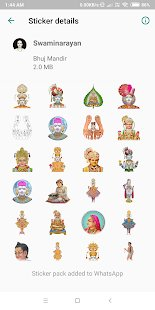

# Swaminaryan Stickers App
An application made for the Swaminarayan Community. It was #3 trending on Playstore. Also has 10K+ Downloads. Swaminarayan Stickers for WhatsApp includes various stickers of Lord Swaminarayan and Hindu images. Add these stickers to your WhatsApp share stickers among your friends & family.

### Installation
 - You use this [link](https://play.google.com/store/apps/details?id=org.bhujmandir.swaminarayan.stickers&hl=en_IN) to download the app from Google PlayStore.
 - How to use this app:
   1. Install and open the app
   2. Tap on '+' OR 'ADD TO WHATSAPP'
   3. Confirm action, it should show success message
   4. Open WhatsApp app and go to a chat screen
   5. Tap on the Emoji button
   6. You will see a new sticker icon at bottom
   7. Tap on it, and you can now use this sticker pack
 - Note : Some WhatsApp versions do not support stickers yet. Please wait for latest WhatsApp version to release.
   
### Screenshots
        
